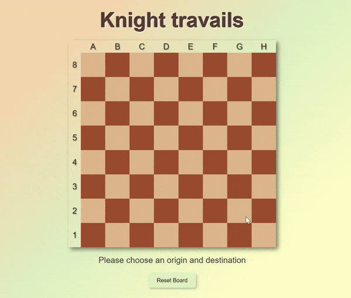

# knights-travails

This project is part of [The Odin Project's JavaScript curriculum](https://www.theodinproject.com/paths/full-stack-javascript/courses/javascript). It demonstrates the application of JavaScript to solve a complex problem: finding the shortest path for a knight to move from one point to another on a chessboard.

## Project Overview

The project showcases a combination of search logic, graph theory, and DOM manipulation to create an interactive chessboard where users can visualize the knight's shortest path from the selected origin to the selected destination.

### Search Logic

The core of the project lies in its search logic, which implements the following functions:

- `getPossibleMovesFrom(tile)`: This function calculates all possible moves for a knight from a given tile, considering the movement rules of a knight in chess.
- `createGraph()`: Generates a graph representing all possible moves from each tile on the chessboard.
- `knightMoves(origin, destination)`: Uses the graph to find the shortest path for the knight from an origin to a destination tile.

### User Interface (UI)

The UI, an addition to the assignment, provides an interactive chessboard where users can:

- Click on tiles to set the origin and destination for the knight.
- Visualize the knight's movement across the board.
- See the step-by-step path in a message area.

### UI Usage

1. **Setting the Origin and Destination**: Users may click on two different tiles on the chessboard to set the origin and destination.
2. **Animation and Path Display**: Upon setting the destination, the knight's figure moves across the board, showing the shortest path. The path is also displayed as text below the chessboard, updating with each move.
3. **Resetting the Board**: The reset button clears the board and allows users to start a new pathfinding sequence.

### Possible Improvements

While the current implementation effectively solves the problem, there are areas for improvement:

- **Iterative Approach**: The current recursive approach in `knightMoves` could be replaced with an iterative solution to improve performance and readability.
- **Optimization**: Further optimization in the pathfinding algorithm could enhance efficiency, particularly for large boards.
- **UI Enhancements**: Additional UI features, such as an option to change board size could enhance user experience.
- **Add responsiveness**: The chessboard is not well displayed in smaller screens.

## Credits

This project uses the following external resources:

- Knight Icon: The knight icon used in the chessboard is from [Font Awesome Free 6.5.1](https://fontawesome.com). The icon is licensed under the [Font Awesome Free License](https://fontawesome.com/license/free). Copyright 2024 Fonticons, Inc.

---
